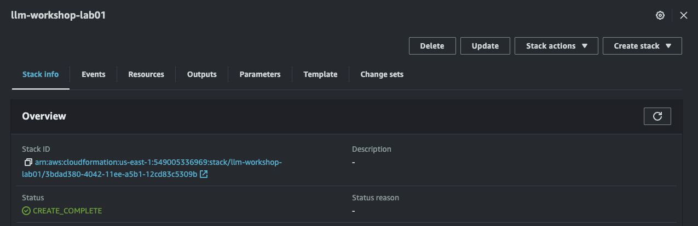

# IaaS Lab01 - Running Large Language Models on EC2 Instances

This lab provides a hands-on introduction on how to run large language models on AWS EC2 instances. More specifically, those made available through Hugging Face's popular and publically available [Transformers](https://huggingface.co/transformers/index.html) library.

## Table of Contents

1. [Lab Objectives](#lab-objectives)
2. [Prerequisites](#prerequisites)
3. [Setting Up Your Environment](#setting-up-your-environment)
4. [Lab Instructions](#lab-instructions)
<!-- 5. [Troubleshooting](#troubleshooting)
6. [Contact](#contact)
7. [Credits and Acknowledgments](#credits-and-acknowledgments) -->

## Lab Objectives

In this lab, you will learn how to:

- Set up and configure an AWS EC2 instance with the proper drivers, compute, and storage to run AI workloads on a GPU.
- Understand how to run hundreds of thousands of open-source models on an EC2 instance via the transformers library.
- Understand how to run a model of your choice from the transformers library on an EC2 instance.
- Understand how to prompt a model of your choice from the transformers library on an EC2 instance.

## Prerequisites
- An active AWS account.
- AWS CLI installed and given access to said account.
- Basic knowledge of Python programming.
- Familiarity with command line interface (CLI).
- Basic understanding of AWS services (specifically [EC2](https://docs.aws.amazon.com/AWSEC2/latest/UserGuide/concepts.html) and [CloudFormation](https://docs.aws.amazon.com/AWSCloudFormation/latest/UserGuide/Welcome.html)) and cloud computing basics.

For more information on configuring your CLI please refer to the [AWS CLI Documentation](https://docs.aws.amazon.com/cli/latest/userguide/cli-chap-install.html) and [Configuring the CLI Documentation](https://docs.aws.amazon.com/cli/latest/userguide/cli-configure-files.html) for instructions on how to do so.


## Setting Up Your Environment
- You must have an active AWS account.
- You must have the AWS CLI installed and given access to said account.

> N.B. This lab utilizes a CloudFormation template to deploy the required infrastructure for the lab. If you can deploy a CloudFormation template, your environment is ready to go. Because all of the Python code is server-side, no additional setup is required for Python.

## Lab Instructions
### Configuration Background

This lab provides an introduction to running large language models (LLMs) on AWS EC2 instances via Hugging Face's transformers library. To run a LLM efficiently on an EC2 instance, some configuration is required:
- The EC2 instance must be configured with the proper drivers to run AI workloads on the GPU.
- The EC2 instance must be configured with the proper Python packages to run the transformers library.
- The EC2 instance must be configured with proper permissions to access services such as the S3 bucket containing the Nvidia drivers.
- The EC2 instance must be configured with the proper computational and storage resources to run the model.
- The EC2 instance must be configured with sufficient and secure means of access, such as an SSH key pair.
- The EC2 instance must be configured with a security group with the proper permissions to access the EC2 instance via SSH.

For brevity's sake, this lab provides a CloudFormation template that will automatically configure an EC2 instance with all the above requirements. The template will leverage [User Data](https://docs.aws.amazon.com/AWSEC2/latest/UserGuide/user-data.html) to address some of the required configurations, such as Nvidia drivers and a Python environment with the required libraries. The template will also create a Key Pair associated with the instance that can be used to SSH into the instance.

Once inside the instance, you will be able to run a Python script to download and interact with a LLM.

#### Let's walk through how the configuration needs are addressed in more detail...

### The EC2 instance must be configured with the proper drivers to run AI workloads on the GPU.

These GPU-compatible EC2 instances are created with a version of the Amazon Linux 2023 AMI. By default, these come installed with open-source Nouveau drivers. Instead, most generative AI workloads require the corresponding Nvidia drivers for your environment. Nvidia has made the drivers available for download. Refer to the following [AWS documentation](
https://docs.aws.amazon.com/AWSEC2/latest/UserGuide/install-nvidia-driver.html) for more details on installing the drivers. The CloudFormation template will automatically download and install the Nvidia drivers on the EC2 instance via its User Data (which runs on boot). This can be found in lines 79-91 of the `template.yaml` file found in this repository:
```
      UserData:
        Fn::Base64: !Sub |
        ...

          #!/bin/bash -xe
          #install nvidia drivers
          sudo yum install -y gcc kernel-devel-$(uname -r)
          aws s3 cp --recursive s3://nvidia-gaming/linux/latest/ .
          unzip *Cloud_Gaming-Linux-Guest-Drivers.zip -d nvidia-drivers
          chmod +x nvidia-drivers/NVIDIA-Linux-x86_64*-grid.run
          sudo ./nvidia-drivers/NVIDIA-Linux-x86_64*.run -s
          cat << EOF | sudo tee -a /etc/nvidia/gridd.conf
          vGamingMarketplace=2
          EOF
          sudo curl -o /etc/nvidia/GridSwCert.txt "https://nvidia-gaming.s3.amazonaws.com/GridSwCert-Archive/GridSwCertLinux_2021_10_2.cert"
          sudo touch /etc/modprobe.d/nvidia.conf
          echo "options nvidia NVreg_EnableGpuFirmware=0" | sudo tee --append /etc/modprobe.d/nvidia.conf
          sudo reboot

```

> N.B. you can use AWS's Deep Learning AMI instead of the Amazon Linux 2023 AMI. The Deep Learning AMI comes with the Nvidia drivers pre-installed. However, the Deep Learning AMI is not free and will incur additional costs. For more information on the Deep Learning AMI, please refer to the following [AWS documentation](https://docs.aws.amazon.com/dlami/latest/devguide/what-is-dlami.html).

### The EC2 instance must be configured with the proper Python packages to run the transformers library.

The Transformers Python library and a set of required associated libraries need to be installed to run the Generative AI models on the instance. The set of required libraries can be found in the `ec2-files/requirements.txt` file. The requirements.txt file was encoded and inlcuded in the instance's the user data, the user data then uses pip3 to install the libraries. This can be seen in lines 65-77 of the `template.yaml` file:
```
      UserData:
        Fn::Base64: !Sub |
        ...

          #!/bin/bash -xe
          sudo yum update -y

          # add requirements.txt and test.py files to instance
          ENCODED_PYTHON_SCRIPT=ZnJvbSB0c....
          ENCODED_REQUIREMENTS_FILE=YWNjZ....
          echo $ENCODED_PYTHON_SCRIPT | base64 --decode > /home/ec2-user/main.py
          echo $ENCODED_REQUIREMENTS_FILE | base64 --decode > /home/ec2-user/requirements.txt

          #set up python env
          sudo yum install python3 python3-devel python3-pip -y

          #install python libs
          pip3 install -r /home/ec2-user/requirements.txt
```

### The EC2 instance must be configured with proper permissions.

The EC2 instance must be configured with an IAM role that has the proper permissions to access the S3 bucket containing the Nvidia Drivers. The CloudFormation template will automatically create this IAM role. This can be found in lines 1-58 of the `template.yaml` file:
```
Resources:
  # create IAM role for EC2 instance
  Ec2InstanceRole:
   Type: AWS::IAM::Role
   Properties:
        AssumeRolePolicyDocument:
          Version: 2012-10-17
          Statement:
            - Effect: Allow
              Principal:
                Service: ec2.amazonaws.com
              Action: sts:AssumeRole
        Path: /llm-workshop/

  # create policy for EC2 instance IAM Role
  Ec2InstanceRolePolicy:
    Type: AWS::IAM::Policy
    Properties:
      Roles:
        - !Ref Ec2InstanceRole
      PolicyName: Ec2InstanceRolePolicy
      PolicyDocument:
        Version: 2012-10-17
        Statement:
          - Effect: Allow
            Action:
              - s3:GetObject
              - s3:ListBucket
            Resource:
              # - "s3://nvidia-gaming/*"
              - "arn:aws:s3:::nvidia-gaming/*"
              - "arn:aws:s3:::nvidia-gaming"

  InstanceProfile:
    Type: 'AWS::IAM::InstanceProfile'
    Properties:
      Roles:
        - !Ref Ec2InstanceRole
      Path: /llm-workshop/
...

# define ec2 instance in cloudformation
  Ec2Instance:
    Type: AWS::EC2::Instance
    Properties:
      ...
      IamInstanceProfile: !Ref InstanceProfile
```

### The EC2 instance must be configured with the proper computational and storage resources to run the model.

Generative AI workloads typically require GPUs to run efficiently. The CloudFormation template will automatically create an EC2 instance with a GPU. This can be found in line 48 of the `template.yaml` file where the `InstanceType` parameter is set to g5.2xlarge:
```
# define ec2 instance in cloudformation
  Ec2Instance:
    Type: AWS::EC2::Instance
    Properties:
      ...
      InstanceType: g5.2xlarge
```

Additionally, LLMs often require many GBs of storage. For this lab, we have attached a 100 GB root volume to the EC2 instance. This can be found in lines 55-58 of the `template.yaml` file:
```
      BlockDeviceMappings:
        - DeviceName: "/dev/xvda"
          Ebs:
            VolumeSize: 100
```

### The EC2 instance must be configured with sufficient and secure means of access such as a SSH key pair.

To enable SSH access, the template creates a key pair and attaches it to the EC2 instance. This can be found in lines 37-50 of the `template.yaml` file:
```
  LLLMEC2KeyPair:
    Type: AWS::EC2::KeyPair
    Properties:
      KeyName: !Sub "LLLMEC2KeyPair-${AWS::StackName}-${AWS::Region}" #  ensures uniqueness across different stacks and regions

  Ec2Instance:
    Type: AWS::EC2::Instance
    Properties:
      ImageId: ami-05548f9cecf47b442
      InstanceType: g5.2xlarge
      KeyName: !Ref LLLMEC2KeyPair
```

The EC2 instance must be configured with a security group with the proper permissions to access the EC2 instance via SSH. This can be found in lines 45-65 of the `template.yaml` file:
```
  InstanceSecurityGroup:
    Type: AWS::EC2::SecurityGroup
    Properties:
      GroupDescription: Enable SSH access via port 22
      SecurityGroupIngress:
        - IpProtocol: tcp
          FromPort: 22
          ToPort: 22
          CidrIp: 0.0.0.0/0
      Tags:
        - Key: Name
          Value: InstanceSecurityGroup

# define ec2 instance in cloudformation
  Ec2Instance:
  ...
      SecurityGroupIds:
        - !GetAtt InstanceSecurityGroup.GroupId
```


When you create a new key pair using AWS CloudFormation, the private key is automatically saved to AWS Systems Manager Parameter Store. The parameter name has the following format:
```
/ec2/keypair/key_pair_id
```

Please see the following AWS documentation for more information: [Create AWS Key Pairs](https://docs.aws.amazon.com/AWSEC2/latest/UserGuide/create-key-pairs.html).

This lab's CloudFormation template creates a CloudFormation Output containing the Key Pair Name to allow automatic retrieval of the private key from the SSM parameter store. This can be found in lines 96-101 of the `template.yaml` file:
```
Outputs:
  LLLMKeyPairId:
    Description: ID of the newly created EC2 Key Pair
    Value: !Ref LLLMEC2KeyPair
    Export:
      Name: LLLMEC2KeyPairID
```

Finally, the deployment script used this output to retrieve the private key from the SSM parameter store and save it to a local file that can then be used to connect to the instance via SSH. This can be found in lines 10-14 of the `deploy.sh` file:
```
KEYPAIRNAME=$(aws cloudformation describe-stacks --stack-name $STACK_NAME --query "Stacks[0].Outputs[?ExportName=='LLLMEC2KeyPairID'].OutputValue" --output text)
echo "The key pair name is $KEYPAIRNAME"
KEYPAIRID=$(aws ec2 describe-key-pairs --filters Name=key-name,Values=$KEYPAIRNAME --query KeyPairs[*].KeyPairId --output text)
echo "The key pair ID is $KEYPAIRID"
aws ssm get-parameter --name /ec2/keypair/$KEYPAIRID --with-decryption --query Parameter.Value --output text > $KEYPAIRNAME.pem
chmod 400 ./$KEYPAIRNAME.pem

echo "You can now connect to the EC2 instance using the following command:"
echo "ssh -i $KEYPAIRNAME.pem ec2-user@$(aws cloudformation describe-stacks --stack-name $STACK_NAME --query "Stacks[0].Outputs[?ExportName=='EC2PublicDnsName'].OutputValue" --output text)"
```

### Step 1: Deploy the CloudFormation Template
As mentioned in the prerequisites of this lab, it is assumed you have the AWS CLI installed and configured with access to your AWS account. If you do not, please refer to the [AWS CLI Documentation](https://docs.aws.amazon.com/cli/latest/userguide/cli-chap-install.html) and [Configuring the CLI Documentation](https://docs.aws.amazon.com/cli/latest/userguide/cli-configure-files.html) for instructions on how to do so.

Clone this repository to your local machine if you have not already done so:
```
git clone https://github.com/trek10inc/generative-ai-curriculum.git
```

To deploy the CloudFormation template, run the following command in your terminal:

> N.B. you need to pass the deploy script a unique environment name. The following example uses an environment variable to do so
```
export ENVIRONMENT_NAME=your-unique-env-name
./deploy.sh $ENVIRONMENT_NAME
```

This will deploy the `template.yaml` file in the root directory of this repository. The template will create the following resources:
- An EC2 instance with the proper configuration to run the transformers library.
- An IAM role attached to the instance with the least privileged access needed.
- A Key Pair attached to the instance to allow SSH access.
- A security group with the proper permissions to access the EC2 instance via SSH.

The CloudFormation Stack's status should say CREATE_COMPLETE once the template has been successfully deployed. This can be found in the AWS Console under CloudFormation and should look something like this:



<!-- The stack name will be the same as the name of the directory containing the template. For example, if you cloned this repository to your local machine, the stack name will be "lab01-ec2-lllm-transformers-lib". -->
<!-- add photo of health check -->


After completing this step, you should have successfully deployed the CloudFormation template and have a running EC2 instance.

### Step 2: SSH into the EC2 Instance
Once the CloudFormation template has finished deploying, you can SSH into the EC2 instance via the command given in the bash deploy script's output. The command will look something like this:
```
ssh -i "ec2-lllm-transformers-lib.pem" ec2-ip-address.compute-1.amazonaws.com
```

You should now be SSH'd into the EC2 instance!

>N.B. Even once the template has been successfully deployed and the EC2 instance is running, it may take a few minutes for the instance to complete its User Data script and to be fully configured and ready to run the model. Once the instance is running and you are SSH'd into the instance, you can use the following command to view the output of the user data and see if it has been completed:
>  ```
>  cat /var/log/cloud-init-output.log
>  ```
>  If the user data was completed, the bottom of the output should look something like this:
>  ```
>  + sudo reboot
>  Cloud-init v. 22.2.2 running 'init' at Mon, 21 Aug 2023 14:59:32 +0000. Up 3.63 seconds.
>  ci-info: +++++++++++++++++++++++++++++++++++++++Net device info+++++++++++++++++++++++++++++++++++++++
>  ci-info: +--------+------+------------------------------+---------------+--------+-------------------+
>  ci-info: | Device |  Up  |           Address            |      Mask     | Scope  |     Hw-Address    |
>  ci-info: +--------+------+------------------------------+---------------+--------+-------------------+
>  ci-info: |  ens5  | True |         172.31.68.76         | 255.255.240.0 | global | 16:d2:bf:c3:84:81 |
>  ci-info: |  ens5  | True | fe80::14d2:bfff:fec3:8481/64 |       .       |  link  | 16:d2:bf:c3:84:81 |
>  ci-info: |   lo   | True |          127.0.0.1           |   255.0.0.0   |  host  |         .         |
>  ci-info: |   lo   | True |           ::1/128            |       .       |  host  |         .         |
>  ci-info: +--------+------+------------------------------+---------------+--------+-------------------+
>  ci-info: ++++++++++++++++++++++++++++++Route IPv4 info++++++++++++++++++++++++++++++
>  ci-info: +-------+-------------+-------------+-----------------+-----------+-------+
>  ci-info: | Route | Destination |   Gateway   |     Genmask     | Interface | Flags |
>  ci-info: +-------+-------------+-------------+-----------------+-----------+-------+
>  ci-info: |   0   |   0.0.0.0   | 172.31.64.1 |     0.0.0.0     |    ens5   |   UG  |
>  ci-info: |   1   |  172.31.0.2 | 172.31.64.1 | 255.255.255.255 |    ens5   |  UGH  |
>  ci-info: |   2   | 172.31.64.0 |   0.0.0.0   |  255.255.240.0  |    ens5   |   U   |
>  ci-info: |   3   | 172.31.64.1 |   0.0.0.0   | 255.255.255.255 |    ens5   |   UH  |
>  ci-info: +-------+-------------+-------------+-----------------+-----------+-------+
>  ci-info: +++++++++++++++++++Route IPv6 info+++++++++++++++++++
>  ci-info: +-------+-------------+---------+-----------+-------+
>  ci-info: | Route | Destination | Gateway | Interface | Flags |
>  ci-info: +-------+-------------+---------+-----------+-------+
>  ci-info: |   1   |  fe80::/64  |    ::   |    ens5   |   U   |
>  ci-info: |   3   |    local    |    ::   |    ens5   |   U   |
>  ci-info: |   4   |  multicast  |    ::   |    ens5   |   U   |
>  ci-info: +-------+-------------+---------+-----------+-------+
>  Cloud-init v. 22.2.2 running 'modules:config' at Mon, 21 Aug 2023 14:59:33 +0000. Up 4.48 seconds.
>  Cloud-init v. 22.2.2 running 'modules:final' at Mon, 21 Aug 2023 14:59:33 +0000. Up 4.82 seconds.
>  Cloud-init v. 22.2.2 finished at Mon, 21 Aug 2023 14:59:34 +0000. Datasource DataSourceEc2.  Up 5.17 seconds
>  ```

You can verify the NVIDIA drivers are successfully installed by running the following command:
```
nvidia-smi
```

This should return output similar to the following:
```
+---------------------------------------------------------------------------------------+
| NVIDIA-SMI 535.86.05              Driver Version: 535.86.05    CUDA Version: 12.2     |
|-----------------------------------------+----------------------+----------------------+
| GPU  Name                 Persistence-M | Bus-Id        Disp.A | Volatile Uncorr. ECC |
| Fan  Temp   Perf          Pwr:Usage/Cap |         Memory-Usage | GPU-Util  Compute M. |
|                                         |                      |               MIG M. |
|=========================================+======================+======================|
|   0  NVIDIA A10G                    On  | 00000000:00:1E.0 Off |                    0 |
|  0%   29C    P8              15W / 300W |      2MiB / 23028MiB |      0%      Default |
|                                         |                      |                  N/A |
+-----------------------------------------+----------------------+----------------------+
                                                                                         
+---------------------------------------------------------------------------------------+
| Processes:                                                                            |
|  GPU   GI   CI        PID   Type   Process name                            GPU Memory |
|        ID   ID                                                             Usage      |
|=======================================================================================|
|  No running processes found                                                           |
+---------------------------------------------------------------------------------------+

```

After completing this step, you should have successfully SSH'd into the EC2 instance and verified the Nvidia drivers are installed.

### Step 3: Run the Model
Now that you are SSH'd into the EC2 instance, you can run the model of your choice from the transformers library. We have provided a script that will automatically download and run the [falcon-7b](https://huggingface.co/tiiuae/falcon-7b) model. To run the script, run the following command:
```
python3 main.py
```

This will automatically download and run the falcon-7b model. The script is set to prompt the model with the following text:
```
Welcome to our workshop focusing on Generative AI on AWS. Generative AI is
```

The model will then generate new unique text based on the prompt. If you run the script again, it will use the model that was downloaded in the previous run and generate a unique text based on the prompt. You can run the script as many times as you would like and it will continue to generate new unique text based on the prompt.

You should have successfully run the main.py script after this step, downloading the model and having it generate new unforeseen text.

### Step 4: Edit the Prompt
The main.py script is set to prompt the model with the following text:
```
Welcome to our workshop focusing on Generative AI on AWS. Generative AI is
```

You can edit this prompt by editing the main.py script inside the instance. To edit the script inside the instance, use the following command:
```
sudo nano main.py
```

Once the file is open, simply change the following line:
```
prompt = "Welcome to our workshop focusing on Generative AI on AWS. Generative AI is."
```

To whatever you would like to prompt the model with. For example:
```
prompt = "I am a robot. I am here to help you."
```

Challenge: Can you get the model to speak in a certain tone? In the voice of someone famous? (e.g. Yoda, Shakespeare, etc.)

After completing this step, you should confidently be able to prompt the model as you see fit.

### Extra Credit: Change the Model
The main.py script is set to download and run the falcon-7b model. You can change this model by editing the main.py script inside the instance. Simply change the following line:
```
model = "tiiuae/falcon-7b"
```

To whatever model you would like to run. For example:
```
model_name = "tiiuae/falcon-7b-instruct"
```

N.B. many models have an "instruct" version, which is well suited for instruction-based prompts.

A list of all available models can be found [here](https://huggingface.co/transformers/pretrained_models.html). At the time of this writing, there are over 290,000 models available. Generative AI models are quickly becoming a major contributor to the open-source community.

After completing this step, you should confidently be able to run any model from the transformers library.

### Clean Up: Delete the CloudFormation Stack

⚠️ N.B. Be sure to delete the CloudFormation stack once you are done with the lab as the EC2 instance will continue to incur costs until it is deleted.

You can exit the EC2 instance by running the following command:
```
exit
```

Once you are done with the lab, you can delete the CloudFormation stack by running the following command:
```
./delete.sh
```

This will delete the CloudFormation stack and all resources created by the stack. Additionally, this will delete the local private key file that was created to allow SSH access to the EC2 instance.

<!-- ## Troubleshooting

A list of common issues and their respective solutions that users may encounter while setting up their EC2 environment and running the models.

## Contact

Information for reaching out for further queries or support.

## Credits and Acknowledgments

Acknowledgments for any third-party resources used during the lab and credits to all contributors. -->
