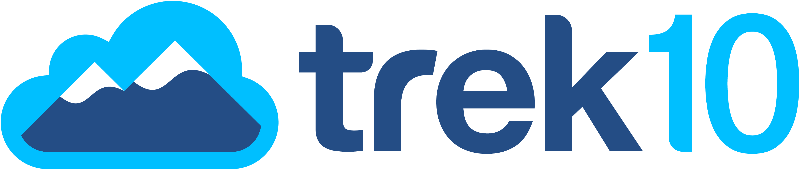

    
    

# Trek10's Generative AI on AWS Curriculum

Welcome to Trek10's Generative AI on AWS curriculum. This repository contains a series of labs focusing on the AWS Machine Learning stack, categorized into three primary sections: Software as a Service (SaaS),  Platform as a Service (PaaS), and Infrastructure as a Service (IaaS). These three levels of abstraction align with the three levels of offerings on the AWS ML stack: ML Frameworks & Infrastructure, ML Services, and AI Services correspondingly. Refer to the [Background](#background) section for more information on the AWS ML stack.

Currently the curriculum includes the following labs:
### IaaS
- [Lab 01: LLMs on EC2 via the Transformers Library](IaaS/lab01-ec2-llm-transformers) (Approx. 30min)

<!-- Planned Labs:
- Lab 02: Quantized Models on EC2
- Lab 03: Pretraining LLMs on EC2 -->
### PaaS
- [Lab 01: AWS SageMaker Finetuning](PaaS/lab01-sagemaker-finetuning-foundational-model) (Approx. 30min)

<!-- Planned Labs:
- Lab 02: AWS SageMaker Instruction Based Finetuning -->
### SaaS
- [Lab 01: Bedrock Introduction](SaaS/lab01-bedrock-introduction) (Approx. 20min)
- [Lab 02: Bedrock Chatbots](SaaS/lab02-bedrock-chatbots) (Approx. 30min)

<!-- Planned Labs:
- Lab 02: Bedrock Generation
- Lab 03: Bedrock Question Answering
- Lab 04: Bedrock Chatbot
- Lab 05: Bedrock Summarization
- Lab 06: Bedrock Text to Image
- Lab 07: Bedrock Translation
- Lab 08: Bedrock RAG
- Lab 09: Bedrock Finetuning -->

## Table of Contents

- [Background](#background)
- [Repository Structure](#repository-structure)
- [Getting Started](#getting-started)
- [Prerequisites](#prerequisites)
- [Contributing](#contributing)
- [Additional Resources](#additional-resources)
- [License](#license)

## Background

<!-- https://aws.amazon.com/types-of-cloud-computing/ -->

The AWS Machine Learning stack is organized into three distinct layers, each serving a specific purpose and audience:

1. **Infrastructure as a Service (IaaS):** IaaS is the least abstracted (most matenience required) layer of the AWS ML stack. It is the bottome layer of the ML Stack and sometimes referred to as ML Frameworks & Infrastructure. This layer provides the core compute, storage, and network resources that serve as building blocks for the other two layers. Services in this layer include Amazon Elastic Compute Cloud (EC2), Amazon Elastic Block Store (EBS), and Amazon Virtual Private Cloud (VPC). For more information please refer to the [AWS Official Documentation](https://aws.amazon.com/what-is/iaas/)

2. **Platform as a Service (PaaS):** PaaS is the middle layer of the AWS ML stack and sometimes referred to as ML Services. This layer provides a higher level of abstraction than IaaS, allowing users to focus on the application layer without having to worry about the underlying infrastructure. This helps you be more efficient as you don’t need to worry about resource procurement, capacity planning, software maintenance, patching, or any of the other undifferentiated heavy lifting involved in running your application. 

    Services and tools in this layer are heavily centered around the platform offered through Amazon SageMaker. SageMaker provides a wide range of tools and services that enable data scientists and engineers to build, train, deploy, and maintain ML models. Tools include Amazon SageMaker Studio, Amazon SageMaker Pipelines, Amazon SageMaker Feature Store, and Amazon SageMaker Debugger. For more information please refer to the [AWS SageMaker Documentation](https://aws.amazon.com/sagemaker/).

3. **Software as a Service (SaaS):** SaaS is the most abstracted (least maintenance required) layer of the AWS ML stack and sometimes called AI Services. This layer provides fully managed services that are ready to use without any setup or configuration required. Some of the services in this layer include Amazon Rekognition, Amazon Textract, Amazon Comprehend, Amazon Kendra, Amazon Lex, Amazon Transcribe, Amazon Translate, Amazon Polly, Amazon Forecast, and Amazon Personalize. For more information please refer to the [AWS AI Services Documentation](https://aws.amazon.com/machine-learning/ai-services/).

Amazon Bedrock is a new service that is currently in preview. It is a fully managed service that allows you to build, train, and deploy LLM using a simple, intuitive, GUIs and/or APIs. It is AWS's managed service for generative AI. For more information please refer to the [AWS Bedrock Documentation](https://aws.amazon.com/bedrock/). The SaaS portion of this curriculum will focus on Bedrock.

Our curriculum is structured to mirror these three layers, providing labs that delve into the details and functionalities of each.

## Repository Structure

The repository is organized based on the AWS ML Stack layers. Each lab is prefixed for easy identification:

- **Infrastructure as a Service (IaaS):**
    - `lab01-...`
    - `lab02-...`
    - ...
- **Platform as a Service (PaaS):**
    - `lab01-...`
    - `lab02-...`
    - ...
- **Software as a Service (SaaS):**
    - `lab01-...`
    - `lab02-...`
    - ...

Each lab comes with its dedicated README containing the lab's instructions and other relevant details.

## Getting Started

Navigate to the lab you wish to complete and follow the instructions in the README.

## Prerequisites

This curriculum is designed to be self contained and attempts to provide all the necessary resources to complete the labs. However, there are a few prerequisites that may help you get the most out of the labs:

- **AWS Account:** You will need an AWS account to complete the labs.
- **AWS CLI:** For some labs, you will need the AWS CLI installed and configured on your local machine. For more information please refer to the [AWS CLI Documentation](https://docs.aws.amazon.com/cli/latest/userguide/cli-chap-install.html).
- **AWS Base Knowledge:** Some labs may require some basic knowledge of AWS services and tools. The labs will try to provide links to relevant documentation where possible. 
- **Python:** Most labs require some basic knowledge of Python.

It is recommended you watch [Andrej Karpathy's State of GPT Talk](https://www.youtube.com/watch?v=bZQun8Y4L2A) to get a better understanding of the current state of Generative AI, LLMs and their capabilities.

## Contributing

We welcome contributions to this curriculum. Please create issues and pull requests as you see fit. Additionally, if you have any questions or concerns please feel free to reach out to the Trek10 team via [email](mailto:bjudson@trek10.com) or [slack](https://trek10-community.slack.com/archives/C02BZ8ZJY5S).

## Additional Resources

- **AWS Official Documentation:** [Link here]
- **Trek10 Resources:** [Link here]
<!-- 
## License

[Your License Information] -->

